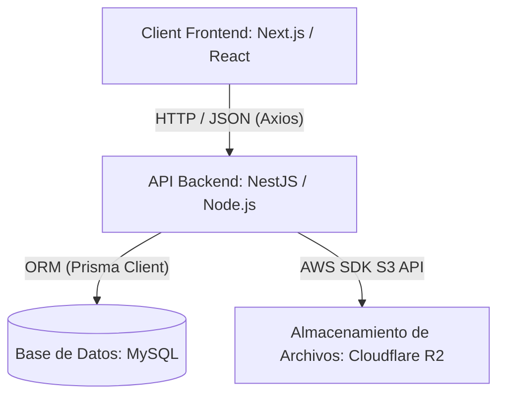
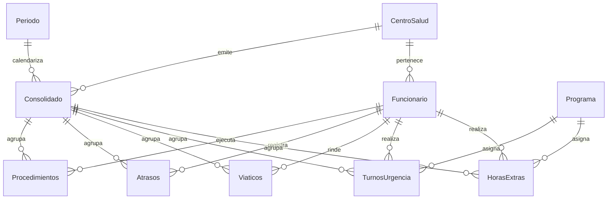

# Manual Técnico del Sistema de Remuneraciones CMP 🏥

Este documento proporciona una descripción detallada de la arquitectura, diseño de base de datos, flujos de datos, matriz de seguridad, endpoints de la API y procedimientos de mantenimiento del **Sistema de Remuneraciones y Gestión de Novedades de Atención Primaria de Salud (APS)**.

---

## 1. Arquitectura General y Stack Tecnológico

El sistema utiliza una arquitectura desacoplada cliente-servidor (3-Tier Architecture) diseñada para garantizar alta disponibilidad, modularidad y fácil despliegue en entornos como cPanel o servidores virtuales dedicados.



### Tecnologías Utilizadas:
* **Frontend**: Next.js 14+ (App Router) con TypeScript, estilizado mediante TailwindCSS, componentes responsivos e interactivos con Framer Motion y Lucide React.
* **Backend**: NestJS (Node.js framework) estructurado de forma modular con inyección de dependencias, validación de datos a través de `class-validator` y protección de rutas mediante Guards de JWT y roles.
* **Base de Datos**: MySQL, gestionada de forma ágil y tipada usando **Prisma ORM**.
* **Almacenamiento**: Cloudflare R2 (compatible con la API de AWS S3) para guardar de forma segura los archivos PDF cargados como respaldo del consolidado mensual.

---

## 2. Estructura de Directorios

### Backend (`backend/`)
El backend sigue el estándar de arquitectura modular de NestJS:
* `src/main.ts`: Punto de entrada del servidor. Configura CORS, prefijo global `/api` y validaciones globales.
* `src/app.module.ts`: Módulo raíz que importa todos los módulos del sistema.
* `src/auth/`: Módulo de autenticación, generación de tokens JWT y encriptación de contraseñas con bcrypt.
* `src/funcionarios/`: Gestión del maestro de funcionarios clínicos.
* `src/consolidados/`: Lógica para el cálculo de sueldos consolidados, firmas de V°B° (Control y Finanzas) y cierres de mes.
* `src/ingresos/`: Procesamiento de novedades del mes (horas extras, turnos, viáticos, atrasos).
* `src/turnos-urgencia/` & `src/horas-extras/`: Módulos específicos para la gestión detallada de estos ítems.
* `prisma/schema.prisma`: Definición del esquema de datos relacional y configuración del cliente de base de datos.

### Frontend (`frontend/`)
El frontend está desarrollado sobre Next.js con la estructura moderna de `src/app`:
* `src/app/page.tsx`: Dashboard Bento principal con KPI y accesos rápidos.
* `src/app/consolidados/`: Listado e historial de consolidados por establecimiento.
* `src/app/consolidados/[id]/`: Detalle de consolidado donde se auditan, editan y aprueban las novedades del mes.
* `src/app/ingresos/`: Interfaz para la carga manual o importación vía Excel de novedades de funcionarios.
* `src/context/AuthContext.tsx`: Contexto de autenticación para persistir la sesión del usuario.
* `src/components/`: Componentes UI reutilizables (Modales, Tablas, Alertas, Botones).

---

## 3. Modelo de Datos (Base de Datos)

El motor de datos relacional modela el flujo mensual de remuneraciones vinculando a cada funcionario con sus novedades a través de un **Consolidado**.

### Diagrama Entidad-Relación



### Explicación de Modelos Principales (`schema.prisma`):
1. **Funcionario**: Almacena datos clave del personal de salud (RUT, nombre, categoría APS, nivel, asignaciones específicas).
2. **Consolidado**: Representa el cierre mensual por Centro de Salud. Registra firmas electrónicas (`firmaControl`, `firmaFinanzas`), montos acumulados y estados (`Borrador`, `En Proceso`, `Aprobado`).
3. **HorasExtras**: Cantidades al 25% y 50% asociadas a un funcionario, periodo y **Programa** de financiamiento.
4. **TurnosUrgencia**: Registra turnos normales y festivos. Se asocia a un **Programa de Turno** específico para permitir múltiples turnos por funcionario en un mismo mes.
5. **Atrasos**: Minutos acumulados de atraso importados o ingresados para su respectivo descuento según el valor del minuto de la categoría del funcionario.
6. **HistorialAuditoria**: Almacena de manera inmutable quién modificó un valor, el monto anterior, el monto nuevo, la fecha y el motivo de auditoría.

---

## 4. Roles y Matriz de Permisos (RBAC)

La seguridad se aplica a nivel de API mediante el decorador `@Roles()` y un guardia personalizado `RolesGuard` que valida el payload del JWT.

| Rol | Descripción | Permisos Clave |
| :--- | :--- | :--- |
| **ADMIN** / **ADMIN_MAESTRO** | Administrador del sistema | Acceso total a base de datos, configuración de parámetros y gestión de usuarios. |
| **CONTROL** | Auditoría interna y validación | Puede otorgar el V°B° CONTROL en el consolidado, auditar registros y exportar consolidados. |
| **FINANZAS** | Aprobación presupuestaria | Puede otorgar el V°B° FINANZAS, modificar montos valorizados y realizar cierres finales del consolidado. |
| **CENTRO_SALUD** / **SECRETARIA** | Encargados locales de CESFAM/CECOSF | Creación de borradores, subida manual y masiva de novedades del mes, carga de PDF de respaldo. |
| **INVITADO** | Auditor externo o consulta | Solo lectura, descarga de informes y visualización de consolidados. |

---

## 5. Lógica de Importación de Novedades y Sobreescritura

Al momento de realizar el envío por lote de novedades (vía manual o importación de Excel) hacia el consolidado del mes, el backend aplica las siguientes reglas de negocio para evitar duplicidades innecesarias:

* **Horas Extras**: El sistema comprueba si ya existe un registro en el consolidado con el mismo `RUT` y el mismo `programa_id`.
  * *Si existe*: Se **sobrescriben** las horas con el nuevo valor ingresado en novedades.
  * *Si no existe*: Se inserta un nuevo registro.
* **Turnos de Urgencia**: Un funcionario puede realizar más de un turno de urgencia en diferentes programas durante el mismo mes.
  * El sistema valida la clave única compuesta por: `consolidado_id` + `funcionario_rut` + `programa_id`.
  * Esto permite que si un funcionario tiene un turno asignado a un programa "A" y otro a un programa "B", **ambos registros se mantengan** en la base de datos de manera simultánea sin sobrescribirse.
* **Atrasos y Viáticos**: Al ser registros de carácter único consolidado en el mes por funcionario, se realiza una sobreescritura directa si se vuelve a enviar un registro con el mismo `RUT`.

---

## 6. Procedimientos de Despliegue y Mantenimiento

### Requisitos del Entorno:
* Node.js v18 o superior.
* Base de datos MySQL 8.0+.

### Comandos de Mantenimiento en Backend (`backend/`):
1. **Generación del Cliente Prisma**:
   Ejecutar tras realizar cualquier cambio en `prisma/schema.prisma` para regenerar los tipos estáticos en el proyecto:
   ```bash
   npx prisma generate
   ```
2. **Aplicación de Migraciones Directas**:
   Para sincronizar el esquema definido en Prisma directamente con la base de datos de producción o pruebas:
   ```bash
   npx prisma db push
   ```
3. **Compilación para Producción**:
   Genera los archivos listos para el despliegue dentro del directorio `/dist`:
   ```bash
   npm run build
   ```

### Ejecución en Servidor (Producción/cPanel):
El backend puede ser ejecutado mediante gestores de procesos como **PM2**:
```bash
pm2 start dist/main.js --name "api-remuneraciones"
```

El frontend se compila con `npm run build` y se levanta mediante `npm run start` o configurando un Custom Server en Next.js.
